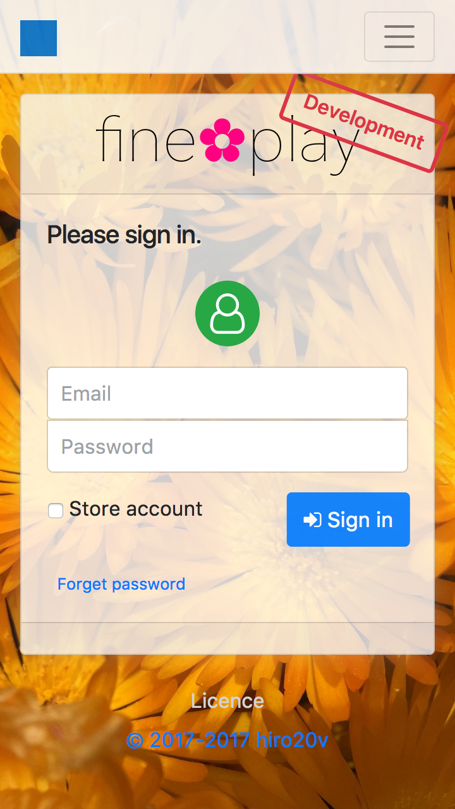

English | [日本語](./README_ja.md)

Play(Java) 2.7 & Bootstrap 4.2  
multilingual responsive project template.

| Phone | Tablet    |
|-------|-----------|
|   |  |

How to play
----------

##### Environment #####

	macOS Mojave version 10.14.2（18C54）
	Time zone UTC
	openjdk version "11.0.1" 2018-10-16 / OpenJDK Runtime Environment 18.9 (build 11.0.1+13)
	Safari version 12.0.2 (14606.3.4)

##### OpenJDK #####

Install

[OpenJDK](http://jdk.java.net/11/)

##### Console #####

	MacBook:~ user$ cd github/FinePlay

	MacBook:FinePlay user$ chmod +x ./sbt-dist/bin/sbt
	MacBook:FinePlay user$ chmod +x ./sbt
	MacBook:FinePlay user$ chmod +x ./start.sh

	MacBook:FinePlay user$ ./start.sh

##### Safari #####

Open URL

[http://localhost:9000](http://localhost:9000)

By clicking the green user icon, users for development can be selected.

Document
-------

### Javadoc ###

##### Console #####

	MacBook:~ user$ cd github/FinePlay
	MacBook:FinePlay user$ ./sbt doc
	MacBook:~ user$ open -a Safari ./target/scala-2.12/api/index.html

### Official Document ###

[JDK](https://docs.oracle.com/en/java/javase/11/docs/api/)

[Play Framework](https://www.playframework.com/documentation/2.7.x)

[Bootstrap](http://getbootstrap.com/docs/4.2)

[Font Awesome](https://fontawesome.com/how-to-use)

This **template** is unofficial.

Support / Additional contents
---------------

##### JDK #####
+ It seems that a [paid version](https://support.oracle.com/epmos/faces/MosIndex.jspx) is being offered by Oracle.

##### Play Framework #####
+ [Commercial support](https://www.lightbend.com/subscription) seems to be provided at Lightbend.

##### Bootstrap #####
+ When you browse the [document](https://getbootstrap.com), I think that it will become advertisement revenue.
+ It seems to be selling the [theme](https://themes.getbootstrap.com).

##### Font Awesome #####
+ When purchasing [Pro version](https://fontawesome.com/pro), it seems that many icons can be used.

Notice
---------------

+ This project is not considered to develop continuously. (However, this template is a very thin wrapper for open source software, so don't worry about it.)
+ This project is not thought to be used for multi purpose. (Since this project is a template, it is forked or modified and used.)
+ Please confirm the license of the library software you are using with this project once again.

TODO
---------------

###### Whether this project will be updated in the future is undecided. ######

### FinePlay 2.7.0 ###
+ Update Play Framework 2.7.0 release  
Update application.conf

### FinePlay 2.7.x ###
+ Update Bootstrap 5.3 release  
Restore temporary correspondence of [This problem](https://github.com/twbs/bootstrap/issues/27903).

### FinePlay x.x.x ###
+ Drop IE / Refactor system_menu.
+ Update Bootbox 5.0 release

Release History
---------------

+ **2.7.0-RC8-βc10** - 2019-01-02
+ **2.6.13-β7** - 2018-06-18
+ **2.6.3-α1** - 2017-08-14
   + First commit

###### The version no is an ornament. It is not understood by a great person.

License
-------
Copyright &copy; 2017-2019 [hiro20v](https://github.com/hiro20v)  
Distributed under the [MIT License][mit].

[MIT]: http://opensource.org/licenses/MIT
