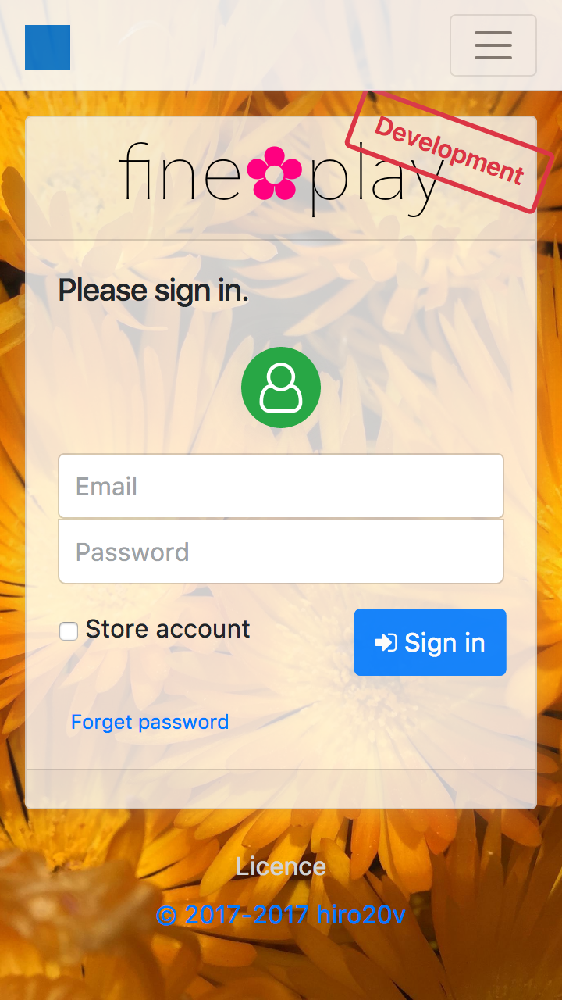

[English](./README.md) | 日本語

Play(Java) 2.8 & Bootstrap 4.4  
多言語、レスポンシブな、プロジェクトのひな形(何かのたたき台に)。

| 携帯 | タブレット |
|-------|-----------|
|   |  |

遊び方
----------

##### 環境 #####

	macOS Catalina バージョン 10.15.1（19B88）
	時間帯 UTC
	openjdk バージョン "11.0.5" 2019-10-15 / OpenJDK Runtime Environment AdoptOpenJDK (build 11.0.5+10)
	Safari バージョン 13.0.3 (15608.3.10.1.4)

##### OpenJDK #####

インストール

[AdoptOpenJDK](https://github.com/AdoptOpenJDK/openjdk11-binaries/releases/tag/jdk-11.0.5%2B10)

##### コンソール #####

	MacBook:~ user$ cd github/FinePlay

	MacBook:FinePlay user$ chmod +x ./sbt-dist/bin/sbt
	MacBook:FinePlay user$ chmod +x ./sbt
	MacBook:FinePlay user$ chmod +x ./start.sh

	MacBook:FinePlay user$ ./start.sh

##### Safari #####

URL を開く

[http://localhost:9000](http://localhost:9000)

緑色のユーザーアイコンをクリックすると、開発用のユーザーを選択できます。

書類
-------

### 公式書類 ###

[JDK](https://docs.oracle.com/javase/jp/11/docs/api/)

[Play Framework](https://www.playframework.com/documentation/2.8.x)

[Bootstrap](http://getbootstrap.com/docs/4.4)

[Font Awesome](https://fontawesome.com/how-to-use)

この **ひな形** は、非公式です。

サポート / 追加コンテンツ
---------------

##### Play Framework #####
+ ライトベンド社で、[商用サポート](https://www.lightbend.com/subscription)が提供されているようです。
+ [フォーラム](https://discuss.lightbend.com/c/play)が開催されているようです。
+ アプリケーションの[実装例](https://github.com/playframework/play-samples)があるようです。

##### Bootstrap #####
+ [ドキュメント](https://getbootstrap.com)を閲覧すると、広告収入になると思います。
+ [テーマ](https://themes.getbootstrap.com)を販売しているようです。

##### Font Awesome #####
+ [Pro版](https://fontawesome.com/pro)を購入すると、より多くのアイコンが使用できるようです。

注意
---------------

+ このプロジェクトは、継続性を考慮していません。（しかし、このひな形は、オープンソースソフトウェアのための非常に薄いラッパーなので、心配しないでください。）
+ このプロジェクトは、汎用的に使用する事は、考えられていません。（このプロジェクトは、ひな形なので、フォークもしくは、修正して使用します。）
+ クライアントライブラリは、ユーザー環境の変化によるリスクを想定して下さい。
+ このプロジェクトで使用している、ライブラリのライセンスは、利用者において改めて、確認してください。
+ このプロジェクトは、個人の趣味として開発しており、ここでのみ配布しています。

やる事(やるとは、言ってない)
---------------

###### このプロジェクトが、将来更新されるかどうかは、未定です。 ######

+ Bootstrap 2.8 リリース版に更新   
   + 廃止予定の修正
+ system_menuのリファクタリング

リリース履歴
---------------

+ **2.8.0-RC1-b1** - 2019-11-03
+ **2.7.3-b2** - 2019-07-06
+ **2.6.13-β7** - 2018-06-18
+ **2.6.3-α1** - 2017-08-14
   + 最初のコミット

###### バージョン番号なんて飾りです。偉い人にはそれがわからんのですよ。

寄付
-------
+ **ペイパル** - https://www.paypal.me/hiro20v/JPY
+ **ビットコイン (BTC)** - 3GQpAVny8EHcGUqWfUJZTuXgNBupi2EKqZ
+ **イーサリアム (ETH)** - 0x66f62f7f6a40bed6d9f01ea0c6257c7706b59661

ライセンス
-------
著作権 &copy; 2017-2019 [hiro20v](https://github.com/hiro20v)  
[MIT License][mit] の下で配布されます。

[MIT]: http://opensource.org/licenses/MIT
