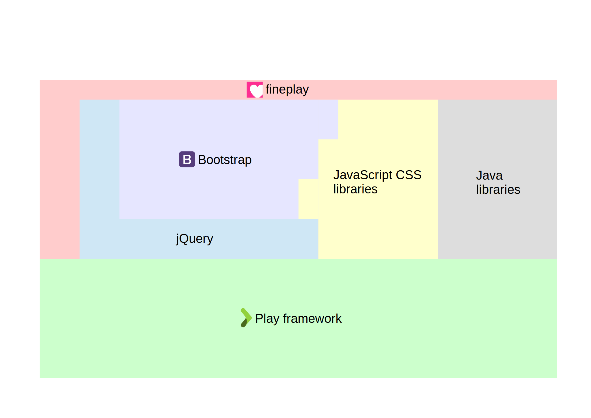
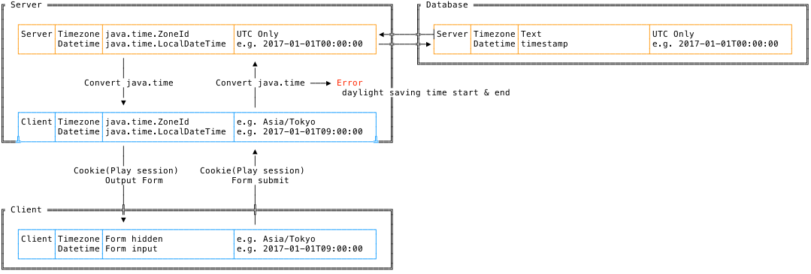

Overview
=======

Purpose
----------

Provide personal learning notes as a template.  
Feedback is welcome.

Software
----------

Time manage
----------

Error handling
----------

The Controller does not raise exceptions that can be considered.  
Failure detection is not possible in advance, or in the case of heavy processing, wrap and throw with PlayException.
